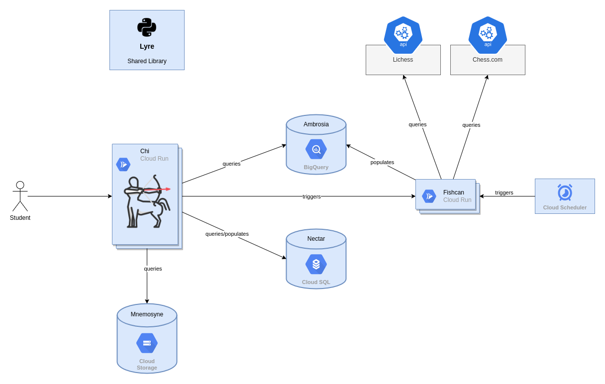

# Chiron: Personal Chess Analytics

Named after the Greek mythological centaur famous for his teaching ability, Chiron is my university project for chess data analytics. 
It's made up of two main components:
- Fishcan - Collects data from public chess APIs and populates a BigQuery data warehouse. Deployed as a serverless container on Cloud Run, uses Flask and the Stockfish 14 engine to analyse chess games.
-  Chi - User interface for visualising collected data and displaying mistakes, along with alternative better moves. Built with Django, Materialize CSS and also deployed as a serverless container on Cloud Run.

